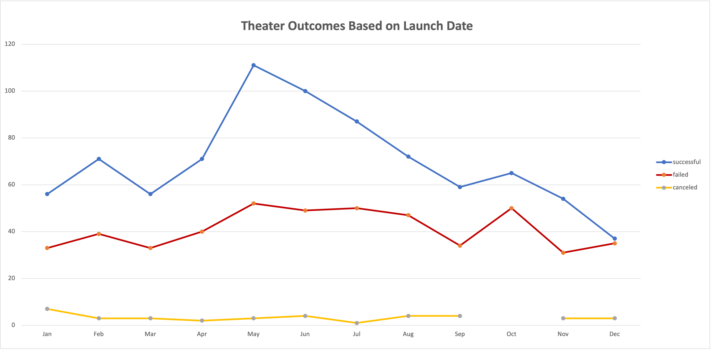
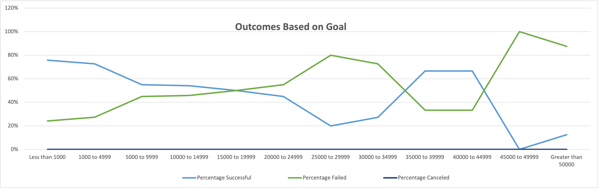

# _Kickstarting with Excel_

# Analysis of Kickstarter Fundraising Campaigns

## Performing Analysis on Kickstarter Data of Fundraising Campaigns to Uncover Trends

### Purpose

#### Playwright Louise plans to launch a crowdfunding campaign to obtain funds for kick-starting her theater production, 'Fever'.  Louise has never launched a crowdfunding campaign, and needs help setting appropriate goals and identifying parameters for making well-informed decisions in creating the most optimal fundraising campaign. For this project, we were provided with a dataset that lays out information about other kick-starter campaigns. The purpose of this analysis is to better understand and filter the tabular data. By performing this analysis, we will observe characteristics of other campaigns to reveal tendencies and patterns concatenated from various datapoints, creating new and useful information that will determine how we can best advise Louise in taking her next steps.

## Analysis and Challenges

#### We performed an analysis of fundraising campaigns according to their respective Launch Dates using a Pivot Table to filter data, and generated a chart to provide a visual representation of this analysis. We aimed here to understand the relationship between the months of the year in which camapigns were started and whether those are relevant in determining more or less propensity for success. We also performed an analysis of campaigns according to fundraising goals, generating a visual representation of that analysis as well. We applied formulas to evaluate tendencies of success and failure, dividing the goals in twelve different ranges. Using the Pivot Table and table of ranges respectively, we were able to generate line graphs that were tailored to salient those specific analytic scopes.

### Analysis of Outcomes Based on Launch Date

#### To generate a line chart exhibiting the total of successful, failed, and canceled campaigns over the twelve months of the year, throughout all years; we first  created a Pivot Chart using Filters for Parent Categories and Years. In the ‘Rows’ field, we dragged in Dates, removing the years and days, and leaving months. In the ‘Columns’ field, we placed Outcomes. In the ‘Values’ field, we placed the Count of Outcomes. 

#### Filtering the data to include only ‘Theater’ from the Parent Category list, and leaving all years as parameters for counts of outcomes in every month, we created a line chart with months of the year in the _x-axis_ and count of outcomes in the _y-axis_, as seen below:

### Analysis of Outcomes Based on Goals

#### To generate a line chart exhibiting the percentage of successful, failed, and canceled campaigns across the various ranges established as monetary campaign goals; we created a table with the total goals represented by twelve ranges, distributed in rows, and seven columns, each representing the number of successful, failed, canceled and total number of projects, and respective percentage of projects. We populated the first three columns with COUNTIF() formulas to retrieve data according to the each fundraising goal range. Column number four contained the sum of the previous three columns. The last three columns contained the percentage of each type of outcome relative to the sum, by establishing the quotient between the number of the respective type of outcome in its respective column and the sum of Total Projects calculated in the fourth column. 

#### The line chart shows the twelve ranges in the _x-axis_, and percentages in the _y-axis_, as seen below:

### Challenges and Difficulties Encountered

#### Spoken from the perspective of a student working on this project as a challenge for _Module 1_ learning, there were specific challenges and difficulties that I encountered.

#### For instance, creating the pivot chart for the ‘Outcomes Based on Launch Date’ analysis presented challenges such as extracting from the date stamps the ranges based on months of the year, which required adding and then subtracting parameters in various fields as experimentation, to then arrive at the correct configuration. 

#### Creating the table for ‘Outcomes Based on Goals’ using 'COUNTIF()' formulas also presented challenges, such as having the circuitous task of copy/pasting the formula several times and altering the specific numbers for every cell, which provided ample room for error. I believe that this task would have been better executed with the aid of automated actions that could be reached by manipulating Excel in programmatic levels. The step of calculating percentages was to be inferred, and wasn’t fully explained, which provided the extra challenge of extrapolating knowledge from material that has been learned. 

#### In both instances, having a visual reference for the correct format of the tables, charts and graphs that were being required was extremely useful. Taking those cues as reference points, I was able to orient the work that was I was doing accordingly.

## Results

#### - What are two conclusions you can draw about the Outcomes based on Launch Date?

  * Most kick-starter fundraising campaigns for theater productions have been launched between the months of April and August, with isolated peaks in February and October. 
  
    * Of those campaigns, those launched in **May**, mainly, but also those launched in June, have shown the **highest likelihood** of yielding **successful results**. 
  
    * Campaigns launched in December have yielded _almost identical_ rates of success and failure.

  * Therefore, **May** would be the **most ideal** time of the year for Louise to launch her kick-starter campaign. Conversely, **December** would be the **least ideal** time of the year to launch the campaign.

#### - What can you conclude about the Outcomes based on Goals?

  * Kick-starter fundraising campaigns for theater productions that set their fundraising goals between $1,000 USD and $5,000 USD were most successful in reaching their goals, setting this goal range apart from all others as the _most ideal way_ to launch a theater campaign.

  * Campaigns that set their goals between $5,000 USD and $20,000 yielded similar rates of around 50% of success and failures alike.

    * Within the USD $15,000—$20,000 range, the total relative count of failed campaigns begins to supersede the percentage of successful ones. 
    
      * This trend continues, and the gap between the outcomes widen significantly at USD $25,000—$30,000 goals;
      
      * The trend reaches its peak at the USD $45,000—$50,000 goal range, with 100% chances of failure.

        * Within this marker, campaign goals between the ranges of USD $35,000 and USD $45,000 **surprisingly invert the trend**, reaching almost as much success rates as campaigns that aimed for the much lower goals of USD $5,000 to USD $10,000.

  * Louise has preliminarily an estimated cost of USD $10,000 needed to kick-start her production. If she chooses to raise a total of USD $10,000, the highest likelihood of reaching those goals would be to launch two separate campaigns, each with a goal of USD $5,000.

  * Further down the road, if Louise launches multiple theater productions simultaneously, and finds herself within more than double her initial estimated costs of USD $10,000 on a given year, it would then be wise to set her campaign goals between USD $35,000 and USD $45,000.

#### - What are some limitations of this dataset?

  * This dataset contains tabular data on fundraising campaigns for nine different categories of projects, and 40 subcategories altogether. The data spreads across 22 countries and is limited to an eight-year period, between the years 2009 and 2017. 
  
    * Since the information that we are looking for is specifically targeted at theater projects, a great deal of this data is irrelevant to us. 

    * The United States is Louise’s main targeted country, which makes data on fundraising of productions in other English-language countries such as Great Britain useful; but rules out most of the other countries that are included in this dataset.
    
    * Lastly, the dataset does not show trends of fundraising campaigns launched within the past five years. The latter information would be especially critical, considering the drastic economic shifts of our most recent times.

#### - What are some other possible tables and/or graphs that we could create?

  * Using the converted dates, we could create an ‘Outcomes Based on Length’ line chart comparing the success rates of campaigns with longer durations versus those that are kept active for a shorter period; to help infer what would be the ideal span for Louise to keep her campaign or campaigns active.

  * Using our descriptive statistical analysis, we could provide Louise with bell charts and box and whisker plots visualizations to show distribution of datapoints in measures of central tendency and measures of spread. These visualizations of statistical analyses would be a useful resource in delivering to Louise a wide-range perspective and a sense of the general outlook of different aspects of kick-starter fundraising campaigns.

  * As additional material, we could create a bar chart comparing the success rates of fundraising campaigns for the five plays that Louise saw at the Edinburgh Festival Fringe, to help her have a visual grasp of the relationship between their respective success rates.

